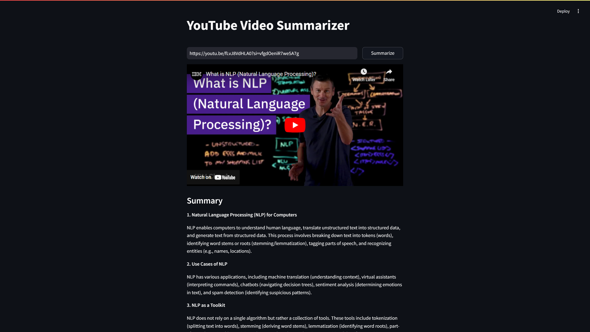

# YouTube Video Summarizer

This is a Python-based web application that generates concise summaries of YouTube videos. The application uses the Google Gemini API for AI-driven text summarization and features a clean, user-friendly interface powered by Streamlit.

## Features
- **YouTube Summarization:** Generate text summaries for YouTube videos by simply providing the video URL.
- **AI-Powered Summaries:** Utilizes the Google Gemini API for advanced language understanding.
- **Streamlit UI:** Offers an intuitive and interactive interface for a seamless user experience.
- **Efficient Workflow:** Separation of frontend and backend processes ensures modularity and easy maintenance.

## Project Highlights
This project marks several first-time achievements:
1. AI integration using Google Gemini API.
2. Python UI development with Streamlit.
3. Completion of a fully functional Python application.
4. Utilization of multiple Python libraries for efficient logic implementation.
5. Interaction between separate Python files for modular programming.
6. Clear division of frontend and backend processes.

## Screenshot


## Installation
1. Clone the repository:
   ```bash
   git clone https://github.com/sanethdassanayake/youtube_summarizer.git
   ```
2. Navigate to the project directory:
   ```bash
   cd youtube-summarizer
   ```
3. Create a virtual environment and activate it:
   ```bash
   python -m venv venv
   source venv/bin/activate  # On Windows: venv\Scripts\activate
   ```
4. Install dependencies:
   ```bash
   pip install -r requirements.txt
   ```

## Configuration
1. Create a `.env` file in the project root directory and add the following variables:
   ```
   GEMINI_API_KEY=your_google_gemini_api_key
   ```
2. Ensure that `.env` is listed in `.gitignore` to keep your API key secure.

## Usage
1. Run the application:
   ```bash
   streamlit run app.py
   ```
2. Open the application in your browser (usually at `http://localhost:8501`).
3. Enter the YouTube video URL and click on "Summarize" to generate the video summary.

## Project Structure
```
youtube-summarizer/
│
├── app.py          # Streamlit-based frontend
├── process.py      # Backend logic for summarization
├── .env            # Environment variables (not included in the repo)
├── .gitignore      # Git ignore file
├── requirements.txt # Python dependencies
└── README.md       # Project documentation
```

## Technologies Used
- **Python**: Programming language for both backend and frontend logic.
- **Streamlit**: Framework for building the interactive UI.
- **Google Gemini API**: AI-powered summarization engine.
- **dotenv**: For securely managing environment variables.

## Future Enhancements
- Add multilingual summarization support.
- Integrate keyword-based or custom summarization preferences.
- Enhance UI for a more engaging user experience.

## License
This project is licensed under the [MIT License](LICENSE).

## Acknowledgments
- Google for providing the Gemini API.
- Streamlit for the intuitive UI framework.
